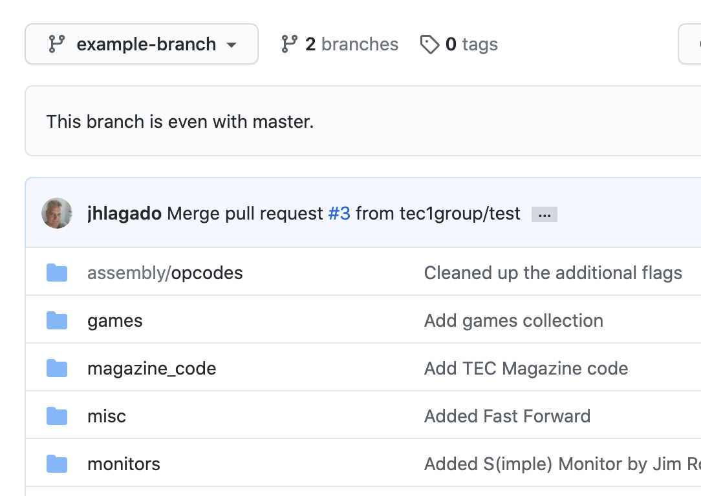
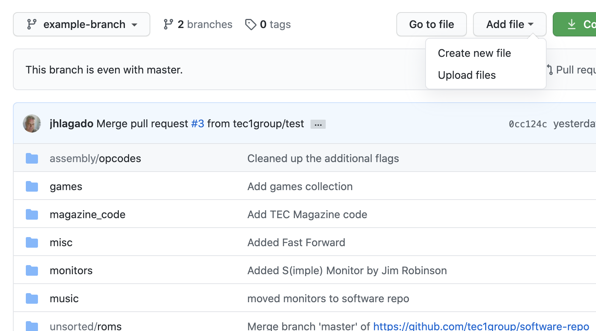
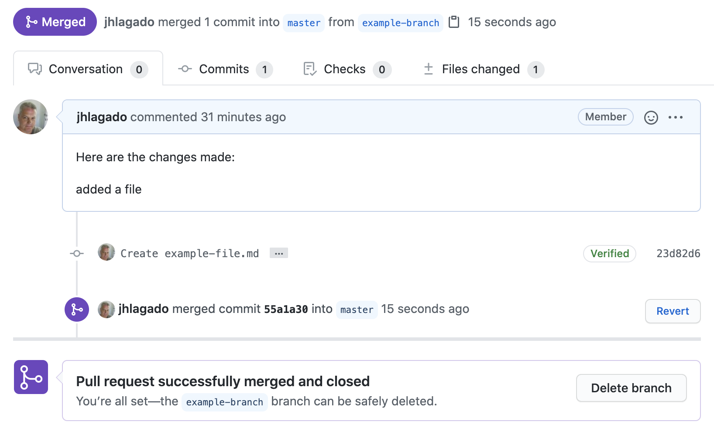

# How to make a pull request using GitHub

### Step 1. Go to the repository

i.e. https://github.com/tec1group/software-repo
Make sure you are signed into GitHub with your account

### Step 2. Create your own branch from master

1. From the branch selector, select the master branch
   
2. Type in the name of a new branch where you will be making your changes
   
3. Select "Create branch" on the drop down
   
4. You are now in your new branch
   

### Step 3. Make your changes

1. Create, edit or upload your changes
   
2. Commit those changes with a short description
   

### Step 4. Create a pull request 
1. Go to the Pull requests tab. There will be a prompt to create a pull request from your latest changes. Alternatively you can just press "New"

2. Choose the destination (i.e. base, usually master) and the source (i.e. compare, your branch). Fill out a description of the changes you have made and anything else that might seem reasonable. Press "Creat pull request"

3. Add the people who you want to review and approve your pull request 

### Step 5. Your pull request can then be reviewed
1. Once the pull request has been examnined it can be merged with master

2. Your branch can then be deleted

